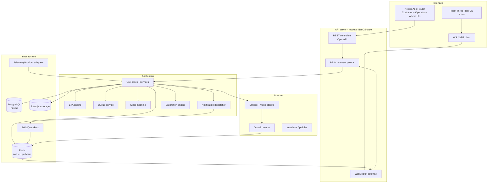
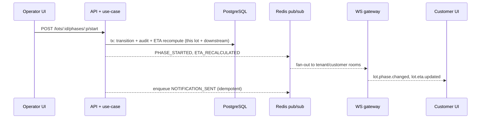

# Architecture — Oleificio Live

## 1. High-level goals

Oleificio Live turns **real plant data** (delivered weight, lot position, plant
capacity, machine state, malaxing times) into a **customer-understandable
timeline**. The decisive component is not the 3D scene but the **advancement /
ETA engine** that simulates the whole line. The 3D scene is a synchronised
*view* of lot state, never the source of truth.

## 2. Layered architecture

The codebase separates four concerns, per the development rules
(*domain / application / infrastructure / interface*):



- **Domain** is pure TypeScript: entities, value objects, the lot/phase state
  machines, invariants, and domain-event definitions. No I/O, no framework.
- **Application** orchestrates use-cases and hosts the ETA engine, queue logic,
  calibration, and notification dispatch. Depends on domain, not on frameworks.
- **Infrastructure** implements repositories (Prisma), cache/pubsub (Redis),
  background jobs (BullMQ), object storage (S3), and telemetry adapters.
- **Interface** exposes REST + WebSocket and renders the three web UIs.

## 3. Monorepo layout

```
oleificio-live/
├── package.json                  # workspaces root (pnpm)
├── pnpm-workspace.yaml
├── docker-compose.yml            # postgres, redis, minio, api, web
├── .env.example
├── tsconfig.base.json
├── prisma/
│   └── schema.prisma             # single source of DB truth
├── docs/                         # this Phase-1 documentation set
│   ├── assumptions.md
│   ├── architecture.md
│   ├── domain-model.md
│   ├── security-model.md
│   ├── eta-engine.md
│   ├── telemetry-integration.md
│   ├── api-spec.md
│   └── adr/
├── packages/
│   ├── domain/                   # pure domain: entities, events, state machine
│   ├── eta-engine/               # the advancement model (line simulator) + tests
│   ├── telemetry/                # TelemetryProvider interface + Manual/Mock/HTTP
│   └── config/                   # shared tsconfig, eslint, zod schemas
└── apps/
    ├── api/                      # backend API server (NestJS-style modules)
    └── web/                      # Next.js App Router frontend + R3F 3D
```

> Phase 1 ships `docs/`, `prisma/schema.prisma`, the monorepo root files, and a
> **fully implemented, tested `packages/eta-engine`** (the decisive core). The
> remaining packages/apps are specified here and scaffolded in later phases.

## 4. Realtime flow

1. An operator action (e.g. *start phase*) hits a REST endpoint.
2. The use-case runs inside a DB transaction: validates the state transition,
   updates the lot/phase, appends an audit event, and recomputes ETAs for the
   affected lot **and downstream queued lots**.
3. Domain events are published to Redis pub/sub.
4. The WebSocket gateway relays `lot.progress.updated`, `lot.phase.changed`,
   `lot.eta.updated`, etc. to **tenant- and customer-scoped** rooms.
5. Notification jobs are enqueued in BullMQ (idempotent by `(eventId, channel)`).
6. The customer UI updates the status card, timeline and 3D scene; the operator
   UI updates the Kanban/queue.



## 5. ETA recomputation triggers

The engine recomputes when: a priority lot is added; a machine is stopped or
restored; a phase overruns; real capacity changes; a lot is paused; effective
quantity changes; new telemetry arrives; or the queue is reordered. Each
recompute writes an `EtaCalculation` row (with inputs + confidence) so estimates
are auditable and explainable.

## 6. Cross-cutting

- **AuthN/Z:** JWT access + rotated refresh tokens; RBAC guard + tenant guard on
  every route and WS subscription. See `security-model.md`.
- **Validation:** Zod at the API boundary; server-side always, never trusting the
  client. Shared Zod schemas live in `packages/config`.
- **Observability:** structured JSON logs (no secrets/PII), request correlation
  IDs, error tracking, app metrics (throughput, ETA error, queue depth).
- **Persistence:** Prisma migrations; append-only `AuditLog`; optimistic locking
  via `version` columns.
