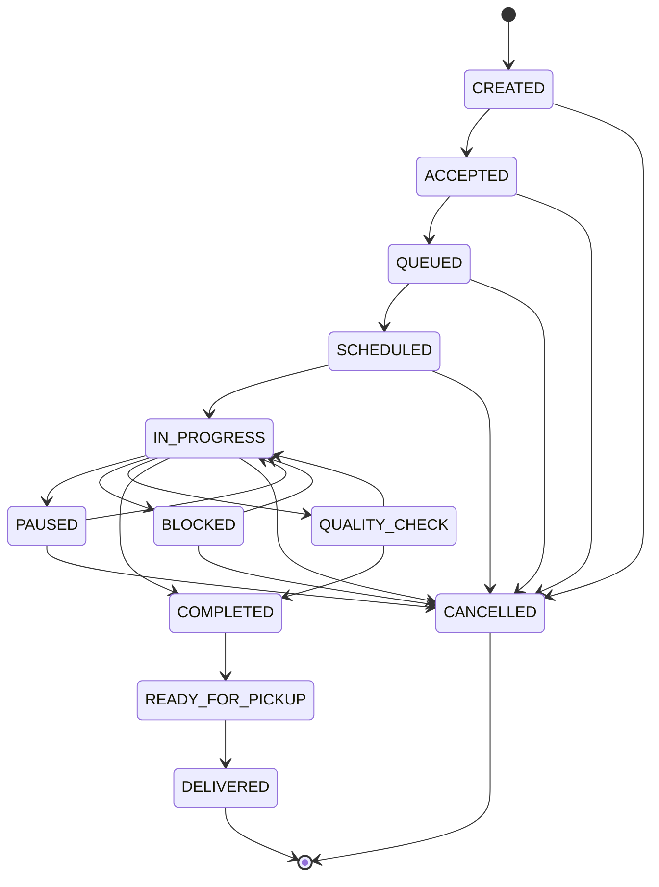
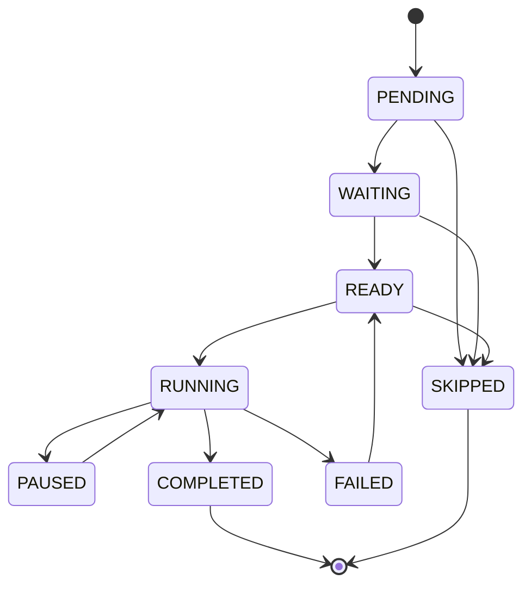
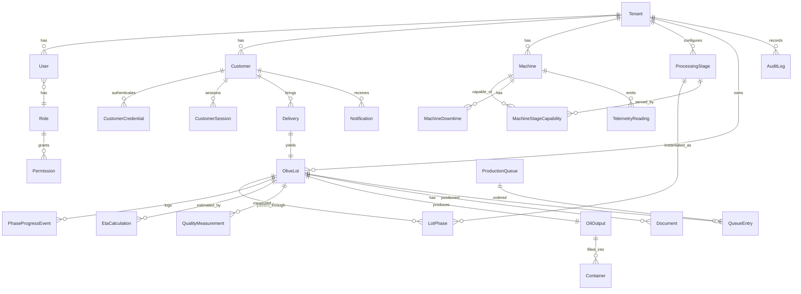

# Domain Model — Oleificio Live

## 1. Production process (default, per-tenant configurable)

1. Conferimento e accettazione
2. Pesatura iniziale
3. Analisi e classificazione *(optional)*
4. Attesa in coda
5. Defogliazione
6. Lavaggio
7. Frangitura
8. Gramolazione *(batch)*
9. Estrazione tramite decanter
10. Separazione verticale
11. Filtrazione *(optional)*
12. Stoccaggio temporaneo
13. Pesatura / misurazione olio
14. Imbottigliamento / riempimento *(optional)*
15. Pronto per il ritiro
16. Consegnato
17. Chiusura del lotto

Each `ProcessingStage` is configurable: enable/disable, reorder, `stageType`
(`CONTINUOUS`|`BATCH`), machine assignment, nominal/min/max capacity, min/avg/max
duration, setup/cleanup time, parallel-allowed flag, max concurrent lots, vat/
malaxer size, and stage dependencies.

## 2. Lot state machine

**Invalid transitions are rejected.** Every accepted transition emits an
immutable audit event carrying `previousState` and `newState`.

## 3. Phase state machine

A phase becomes `READY` only when its `requiresPreviousStage` dependency is
`COMPLETED` (or `SKIPPED`) and an eligible machine is free (respecting
`allowsParallelProcessing` / max concurrent lots).

## 4. Entity relationships (ER)

## 5. Key entities (fields summarised; full types in `prisma/schema.prisma`)

- **OliveLot** — `publicTrackingCode`, `internalLotCode`, `status`, `priority`,
  `oliveWeightKg`, `oliveVariety`, `harvestDate`, `arrivalDate`,
  `estimatedStartAt`/`estimatedCompletionAt`, `actualStartAt`/`actualCompletionAt`,
  `estimatedOilLiters`/`actualOilLiters`, `yieldPercentage`, `currentStageId`,
  `currentMachineId`, `progressPercentage`, `version`.
- **ProcessingStage** — `code`, `name`, `customerDescription`,
  `internalDescription`, `orderIndex`, `stageType`, `isOptional`, `isEnabled`,
  `defaultMin/Average/MaxMinutes`, `setupMinutes`, `cleanupMinutes`,
  `allowsParallelProcessing`, `requiresPreviousStage`, `animationKey`.
- **Machine** — `code`, `name`, `type`, `status`, `nominalCapacityKgPerHour`,
  `effectiveCapacityKgPerHour`, `batchCapacityKg`, `parallelBatchCount`,
  `efficiencyFactor`, `currentTemperature`, `currentLotId`, maintenance dates,
  `telemetryEnabled`, `telemetrySource`.
- **TelemetryReading** — `machineId`, optional `lotId`, `metric`, `numericValue`,
  `textValue`, `unit`, `quality`, `sourceTimestamp`, `receivedAt`.
- **EtaCalculation** — snapshot of the inputs, resulting `[low, high]` window,
  `confidence`, `basis` (time vs telemetry), and `computedAt` — makes every ETA
  explainable and auditable.

## 6. Domain events

`CLIENT_CREATED`, `CLIENT_CREDENTIALS_GENERATED`, `DELIVERY_REGISTERED`,
`LOT_CREATED`, `LOT_ACCEPTED`, `LOT_QUEUED`, `LOT_SCHEDULED`, `PHASE_STARTED`,
`PHASE_PROGRESS_UPDATED`, `PHASE_PAUSED`, `PHASE_RESUMED`, `PHASE_COMPLETED`,
`MACHINE_STOPPED`, `MACHINE_RESTARTED`, `ETA_RECALCULATED`,
`QUALITY_DATA_RECORDED`, `OIL_QUANTITY_RECORDED`, `LOT_COMPLETED`,
`LOT_READY_FOR_PICKUP`, `DOCUMENT_UPLOADED`, `NOTIFICATION_SENT`,
`LOT_DELIVERED`.

Every event carries: `eventId`, `tenantId`, optional `lotId`, optional
`machineId`, `eventType`, `timestamp`, `actorType`, `actorId`, `source`,
`payload`, `correlationId`, `previousState`, `newState`.
