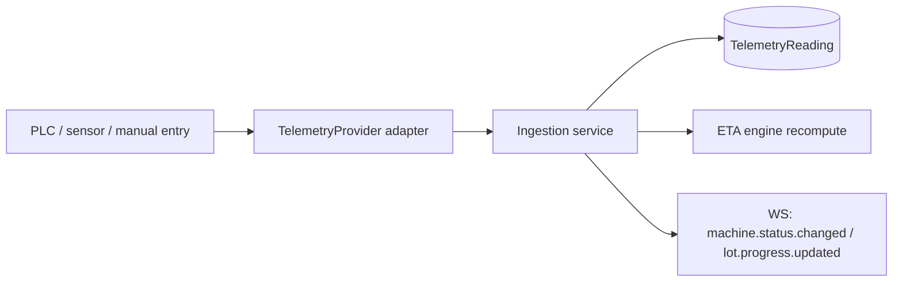

# Telemetry Integration — Oleificio Live

## 1. Principle

The plant may or may not expose sensors/PLC. The system **always works in manual
mode**. When telemetry is present and fresh, it **overrides** time-based
progress. PLC registers, MQTT topics and OPC UA node IDs are **never invented** —
they are per-tenant configuration provided by the machine manufacturer.

## 2. Abstraction layer

```ts
export interface TelemetryEvent {
  machineId: string;
  metric: string;              // e.g. "throughput_kg_h", "temperature_c", "progress_fraction"
  numericValue?: number;
  textValue?: string;
  unit?: string;
  quality: "GOOD" | "UNCERTAIN" | "BAD";
  sourceTimestamp: string;     // ISO, from the device clock
}

export interface MachineStatusSnapshot {
  machineId: string;
  status: "IDLE" | "WAITING" | "ACTIVE" | "PAUSED" | "ERROR" | "COMPLETED" | "MAINTENANCE";
  readings: TelemetryEvent[];
  observedAt: string;
}

export interface TelemetryProvider {
  connect(): Promise<void>;
  disconnect(): Promise<void>;
  getMachineStatus(machineId: string): Promise<MachineStatusSnapshot>;
  subscribe(machineId: string, cb: (e: TelemetryEvent) => void): Promise<() => void>; // returns unsubscribe
}
```

## 3. Providers

| Provider | Phase 1 status | Notes |
|----------|----------------|-------|
| `ManualTelemetryProvider` | **Implemented** | Operator-entered readings become telemetry events. Always available. |
| `MockTelemetryProvider` | **Implemented** | Deterministic simulated readings for demo/tests (accelerated line). |
| `HttpTelemetryProvider` | **Implemented** | Generic HTTP polling/webhook; configurable endpoint + field mapping per tenant. |
| `OpcUaTelemetryProvider` | Interface only | Requires manufacturer node-ID map. |
| `ModbusTcpTelemetryProvider` | Interface only | Requires manufacturer register map. |
| `MqttTelemetryProvider` | Interface only | Requires manufacturer topic map. |

The interface-only providers throw a clear "mapping not configured" error until a
per-tenant mapping is supplied — they never fabricate registers/topics.

## 4. Freshness & trust

- A reading is **fresh** if `now - sourceTimestamp <= staleThreshold` (per-machine
  configurable) and `quality != "BAD"`.
- Stale or `BAD` telemetry is ignored for progress; the ETA falls back to the
  time model and lowers confidence to `LOW`.
- Telemetry `progress_fraction` (0–1), when fresh, replaces `elapsed/estimated`.

## 5. Mapping configuration (per tenant, provided by mill)

Stored as `Machine.telemetrySource` + a mapping record:
```
{
  "provider": "modbus_tcp",
  "endpoint": "10.0.0.12:502",
  "map": {
     "throughput_kg_h": { "register": "<from manufacturer>", "scale": 1 },
     "temperature_c":   { "register": "<from manufacturer>", "scale": 0.1 }
  }
}
```
The `<from manufacturer>` values are intentionally blank in seed data.

## 6. Flow


